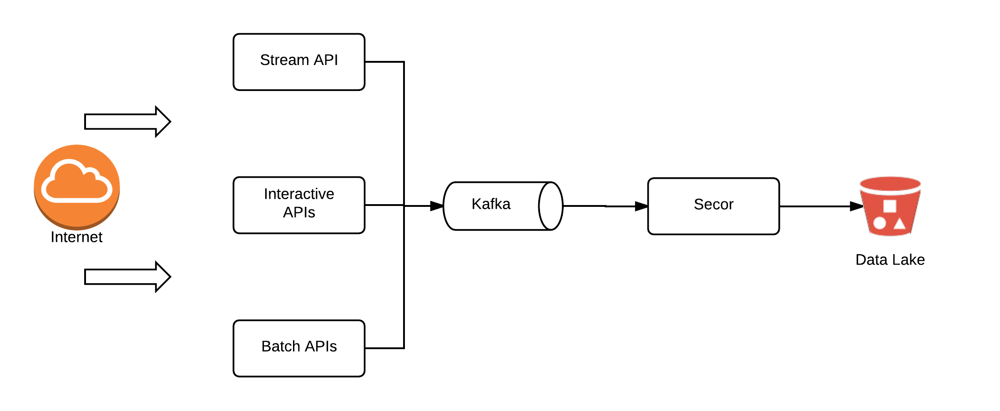
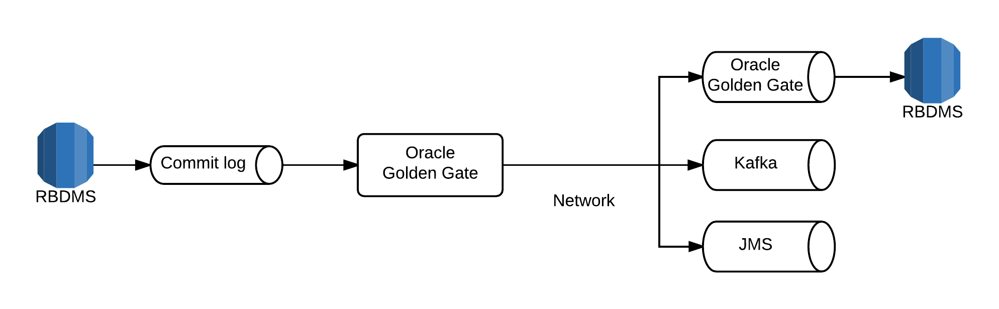

## The Changelog

### Overview

In order to avoid having siloed monolithic datastores, you must ensure that the entity changes being applied in one datastore are available to downstream systems. In addition to this, one of the fundamental requirements of the lambda architecture is that you have an append only immutable data source that acts as a system of record. This is where journals come into play. 

To propagate this change log around you need a distributed messaging system. We use Kafka for our distributed messaging system. There are many features of the Kafka architecture that make it absolutely ideal for Big Data messaging systems but in the simplest terms it is that it functions as a highly scalable append only distributed commit log. 

There are no transactions with Kafka which forces you to think in other ways (like idempotency) and this is a mindset and pattern you must use in Big Data systems. Kafka can achieve very high throughput rates for both producers and consumers without issue and you will find most often that the network is the bottleneck (its use of the [zero-copy](https://www.ibm.com/developerworks/library/j-zerocopy/) functionality in the JVM is particularly nice and facilitates high throughput).

We have many REST APIs for CRUD operations on transactional and user data. The datastore backing these APIs is Cassandra and we do not have it modeled in an immutable append only manner (even though you could sort of view Cassandra's’ data model as an append only commit log if you ignore compactions). However as we use Kafka for our change log, we must also publish all CRUD changes we make in our datastores to Kafka. Besides, all of our behavioural data is published straight to Kafka and Kafka only (downstream consumers create views from this).

Publishing to two datastores can cause problems as we are required to write to two datastores without the concept of a global transaction. Even if we could use transactions we wouldn’t as they have fundamental scaling limits which are difficult to work past (see [here](http://www.ics.uci.edu/~cs223/papers/cidr07p15.pdf)). As mentioned earlier using idempotent publishing is the typical way to handle this. However it is not always easy to implement. With our CRUD based REST APIs Cassandra is the source of truth and so we must write to it first and Kafka second. We plan on implementing a more sophisticated mechanism for managing idempotent writes across these two stores in our services but we have not done so yet. This means that we may have some drift between the changes we write to Cassandra and the changes we publish to Kafka. We keep track of this drift and depending on the issue severity we can decide on a full rebuild of the affected entity type or simply republishing of the entities. 

There are newer approaches to dealing with this issue of read-after-write consistency via APIs and event sourcing. This typically involves something along the lines of Akka and Akka http where all processing is stateful. We did not want to have to implement such an architectural changes at the time as it was too much risk to change all of our APIs and our data pipeline at the same time. Potentially this can be revisited later but we have some reservations about this type of an event sourcing architecture for all APIs and whether the additional complexity is really worth it. 

Another way people work around the issue of publishing changes from the database which is source of truth to Kafka (or another messaging system or datastore) is by hooking into the commit log of the database. This has the added benefit of requiring no producer changes and in fact it is transparent to the producer. The services only write to one location! One particular solution I’ve used in a previous life was Oracle Golden Gate for replicating changes from an Oracle 11G database to an IBM Websphere message queue. There are similar connectors for consuming from various other RDBMS systems (e.g. [mysql](https://github.com/shyiko/mysql-binlog-connector-java), [postgresql](https://github.com/confluentinc/bottledwater-pg)) and producing to a variety of datastores including Kafka. 

Unfortunately it's not possible to achieve this with Cassandra as the Cassandra commitlog does not contain sufficient information since it only contains the new attribute values for the key that was updated - we cover in the following section why this is not enough.

Partitioning and the partition key in Kafka is an important concept. Unlike some messaging systems where you just publish to a queue, in Kafka you can decide on which partition within a topic to publish to. This is how you ensure ordering while achieving scale via partitioning. You should almost always use a consistently hashed partition key instead of random partitioning when producing to Kafka so you can be sure that consumers will read changes to the same entity in-order. 

Kafka is a durable datastore (messages are always committed to disk) and is HA (the commit log is replicated across 3 nodes in our setup). However we do not keep the commit logs forever and have a TTL configured on most of our heavy throughput topics of around 3 days. To ensure we always have this data for replays and change history,  we replicate the topics to S3 using [Secor](https://github.com/pinterest/secor) within the hour for long term storage. Having the data on S3 enables us to run large batch jobs which consume this data without impacting our primary Kafka cluster which has some real time requirements (we could implement multiple clusters with different throughput and latency requirements but we have not done so yet). 

Note that you may find that the Secor logs on S3 are very fragmented depending on how you configure the replication (frequency of uploads, max file size, bucketing etc). A simple solution to this fragmentation is to use s3distcp which enables you to effectively compact files.

### Data Model of Changelog Messages

The format of the messages we publish to this log are 

    "provenance": {
          “apiVersion”: <>,
          “serviceName”: <>,
          “identifier”: <>
     }

     <currentEntityState>              // order, session, guest etc
     <originalEntityState>             // originalOrder, originalSession, originalGuest etc

<originalEntity> is the value of state entity before the change which resulted in the new state being published. This is clearly empty when when a change event is published for a newly created entity but if an entity is updated via any API, it should be present here. 

With the current and previous (original) entity states, a consumer can analyse any attribute they wish on the entity to determine if it should take an action based on the change. This allows us to completely decouple any downstream consumer logic from upstream producers. 

Some might wonder why we don’t produce the more "classical" representation of a change log where only the changes are published (as described [here](http://www.ics.uci.edu/~cs223/papers/cidr07p15.pdf)). This has benefits in terms of size and reduced consumer complexity for consumers who only care about the deltas, e.g. aggregate delta management, attribute change time series etc. However even in the classical representation you should always pass the current and previous state of the changed **attributes **even if you don’t pass the entire entity as we do here. The reason for this is obvious when you consider an example like maintenance of an aggregate value by some type of downstream streaming analytics. If there is a mutable value like an Order amount which can be updated via APIs, the only way to maintain for example the total spend of the owner of that order by looking at the changelog alone is to know the true Order amount “delta”. You could complicate your producers and APIs to determine this and publish special messages or you could treat it just like any other attribute change and send the original and current values and let downstream worry about determining the change is “current amount - original amount”. As we publish the original and current entire entity state we publish more information than is needed in this use case. And in fact a lot of the data is duplicated between the two version especially for larger entities when only a single attribute is changed. 

However the greatest benefit with the approach we have taken is once again in the flexibility it provides downstream consumers. Not just in terms of simplicity but performance. We have many downstream consumers which maintain "views" in different types of datastores for different purposes. Some might be searchable datastore or an active guest cache. In both cases, if we only published the deltas we would have some challenges ahead of us. Both datastores would require the ability to perform partial updates. However, what is a partial update of a key-value cache? Hence you end up re-reading the full entity from some datastore which provides you access to it in order to rewrite the full entity as key-value into the cache. That is bad enough in terms of performance, but it is even worse in terms of data races and consistency. The delta message which the consumer is basing their action off of was produced at a certain point in time. There is no guarantee whatsoever that another change possibly to the same attribute on the same entity has not occurred since and then you enter a data race condition with the query you’re performing to get the entity state. You can mitigate this by providing a datastore where you can query for a certain version of the entity but again that is an unnecessary performance and complexity overhead that can be avoided by simply producing the entities as we do.

Thanks to how we publish the messages, we can easily produce a representation with only the changed attributes with minimal effort.  We recently came across the [following](https://github.com/flipkart-incubator/zjsonpatch) library which implements the Json Patch protocol and means the change log can be produced by applying the diff between the current / original entity states using this library and writing the patch to another topic. 

### Data Provenance  

Data provenance is used to provide a historical record about the data and its origins. It is essentially metadata about the source of the data. When you receive data from many sources it can become difficult to trace which source the data came from when looking at it in some data store much further downstream. This can become even more complicated when you have more than one source for the same data where one can update the other. Again if you are looking at the current state in some datastore downstream there are some key questions you might want to know about the origins of the data. These might include which API, Service or Provider did this come from. Is it composed of more than one and what was the data passed from each that resulted in the current state. This information can also prove to be invaluable for debugging, audit trails and security purposes.

Providing provenance information along with an event sourcing based architecture means that you can always track down and answer these questions. 

In our architecture we also have another use for provenance which is to allow us to treat the same data received from different sources differently downstream. For instance we may not process batch oriented data in the same way as we process real time data and decide to either throttle or filter out completely this data from a given view. Having the provenance metadata on each message makes such an approach trivial. 

